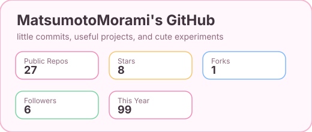
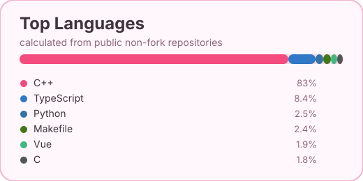

<h1 align="center">Hi, I'm MatsumotoMorami ૮₍ ˶ᵔ ᵕ ᵔ˶ ₎ა</h1>

<p align="center">
  一个喜欢把想法做成真实项目的开发者<br>
  会写前端 也会写后端 爱好是写 QQBot
</p>

<p align="center">
  <a href="https://sekai.morami.icu">
    
  </a>
</p>

## About Me

信息学奥赛出身, 从很小的时候就开始学了, 所以会一点C++和算法与数据结构; 平时一直在写 Bot 啦, 用 Koishi + Napcat 去开发; 前端常用 Next.js, 移动端和多端部署会用 Flutter, Vue 也稍微会写一点; 后端、中间件、CLI会用 Rust, 偶尔会用 Express 写后端; 服务器维护也稍微会一点啦

## Tech Stack

```txt
Frontend     Next.js / Vue / JavaScript / TypeScript
Mobile       Flutter / Dart
Backend      Rust / Express / Node.js / REST API / C++
Systems      Rust
Server       Linux / Nginx / Docker / Deployment / Database / Maintenance
```

## GitHub

<p align="center">
  
</p>

<p align="center">
  
</p>

平时会在这里放一些练手项目、工具、Bot 相关代码和自己折腾出来的小东西。
这些统计卡片由仓库里的 GitHub Actions 自动刷新, 不依赖外部统计服务 ૮₍ ˶ᵔ ᵕ ᵔ˶ ₎ა

---

<p align="center">
  Thanks for visiting. Hope you find something useful here ฅ^._.^ฅ
</p>
